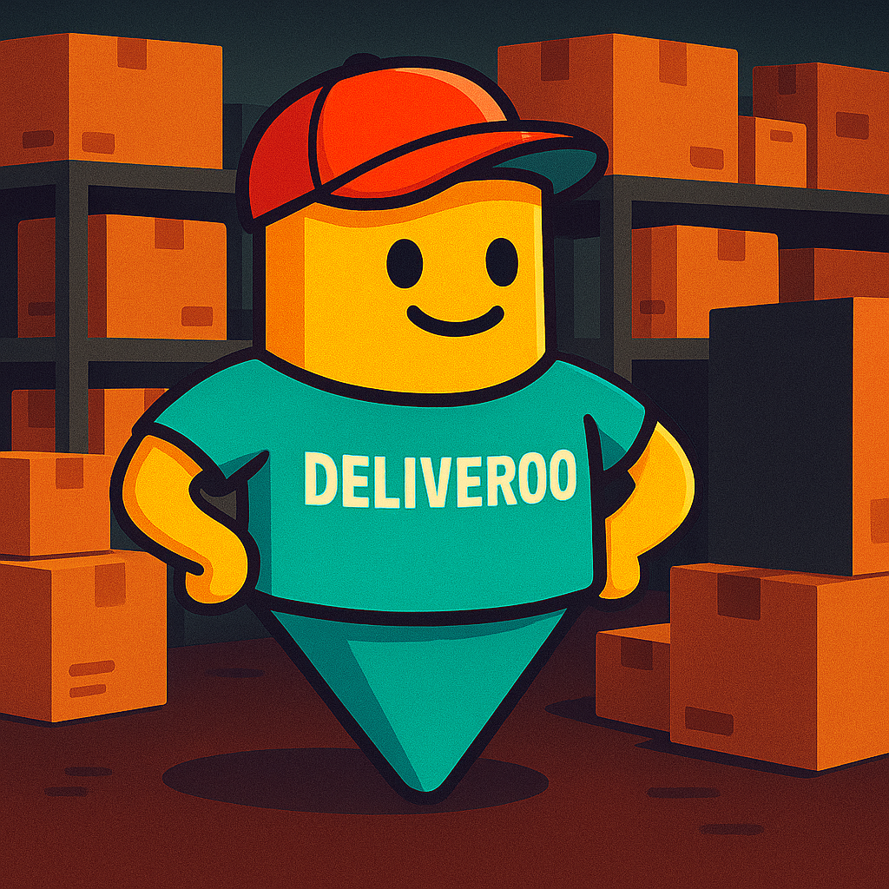

<p align="center">

</p>

# 🚀 Deliveroo

A Node.js–based autonomous agent for the Deliveroo simulation environment. It connects to a Deliveroo server, uses PDDL-based planning to make delivery decisions, and supports both single-agent and multi-agent modes. 🤖📦


## 🏃‍♂️ Run Locally


```bash
# Clone the repo
git clone https://github.com/bandomatteo/Deliveroo

# Go to the project directory
cd Deliveroo

# Install dependencies
npm install
```

## ⚙️ Configuration
This project uses `dotenv` to load configuration from a `.env` file. 

Create a file named `.env` in the project root with the following variables:
```dotenv
HOST=<your_deliveroo_server_url>
TOKEN=<your_api_token>
TOKEN_SLAVE=<your_slave_agent_token>  # In case you use the multi agent option

```
## ▶️ Usage/Examples

```bash
# 🧑‍💻 Single-Agent Mode
npm run start-single

# 👥 Multi-Agent Mode
npm run start-multi

# 📑 Single-Agent with PDDL
npm run start-single-pddl
```

## 📄  Documentation

The documentation is available here: [Documentation](https://linktodocumentation)

Or if you want to generate the documentation by yourself:
```bash
npm run generate-docs
```


## ✍️ Authors
- [Jonathan Fin](https://github.com/Nathanoj02)
- [Matteo Bando](https://github.com/bandomatteo)


