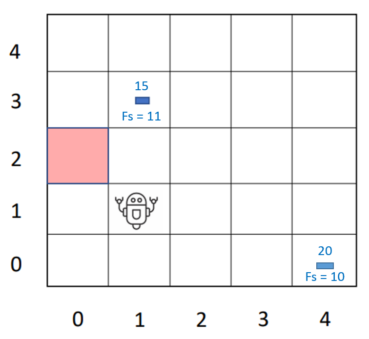

# Strategy

## No other agents
Get all parcels &#8594; find the best one.
Attributes:
- Value $v$
- Distance from player $d_P$
- Distance from home $d_H$

Best parcel &#8594; $argmax(v - d_P - d_H)$



Same score &#8594; pick parcel closer to us (less chance of stealing)

$d_H$ is calculated as the distance between the parcel and its closest home. <br>
$d_H = \min(d_h \quad \forall h \in H)$

## With other agents
Additional checks:
```
if see another agent
    if agent is closer than us
        if 1 tile away from parcel OR going towards the parcel
            drop parcel and choose another one
```
Another agent that is 1 tile away from a parcel if assumed to pick up that parcel (*or should the stategy change?*)

## When to go home?
From position $p$ the points scored when dropping the parcels in a home $h$ is the following: <br>
$score = distance(p, h) * n_{pc}$ <br>
with $n_{pc}$ being the number of parcels currently carried by the player.

### Explanation
Parcels lose 1 point each second and you should multiply that for the number of parcels you are carrying.

### Go home
Player should go home if the score from going home is <u>higher</u> than the score the player would obtain from picking up the best parcel and <u>then</u> go home. <br>
*What if there are multiple high value parcels close together?*

## No parcels sensed
*Possible strategies*:
- Explore new area of map
- Return close to a home
- Walk randomly

